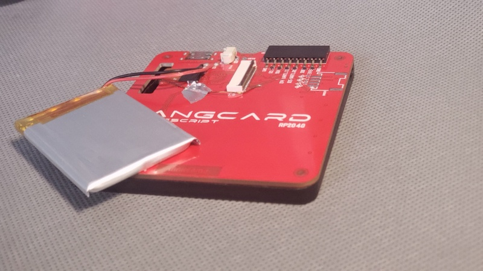
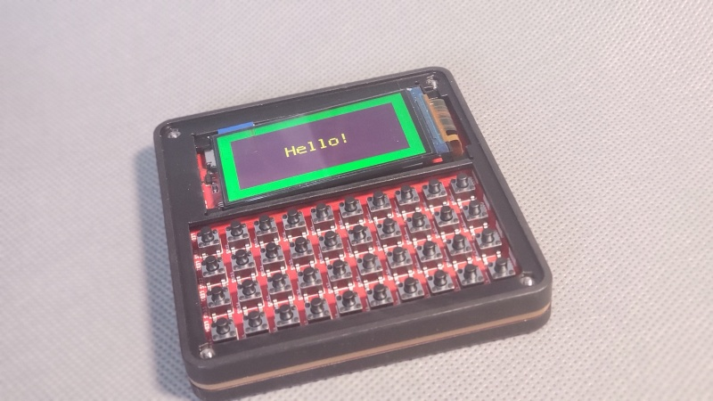
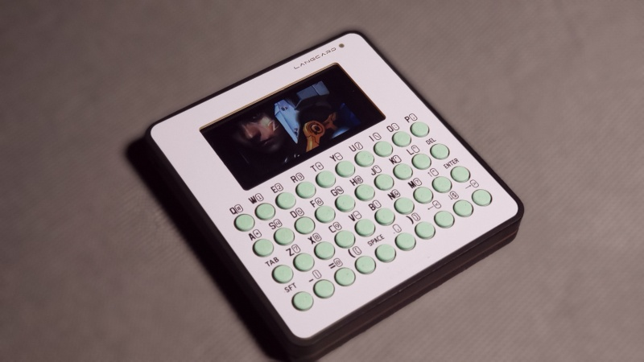
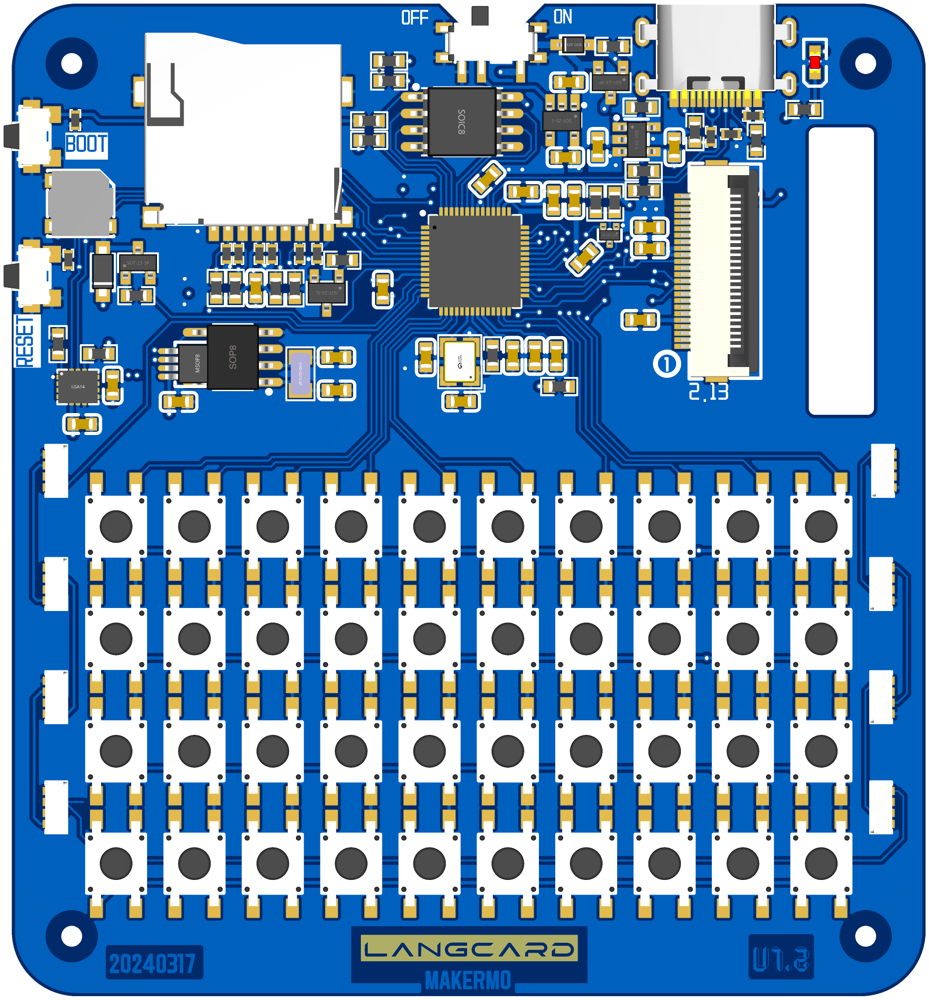

# LangCard_rp2040

# PCB

The panel is made in the form of a PCB with a thickness of 1.0mm.

The thickness of the motherboard is 1.6mm, and the latest version is  Ver1.2.

# Thanks

The [PCBway](https://pcbway.com/g/9CosjL) sponsored the project.

The demos is from:

- [github.com/Bodmer/TFT_eSPI](https://github.com/Bodmer/TFT_eSPI)
- [github.com/lvgl/lvgl](https://github.com/lvgl/lvgl)

- [github.com/VolosR](https://github.com/VolosR)
- [CircuitPython](https://circuitpython.org/)

